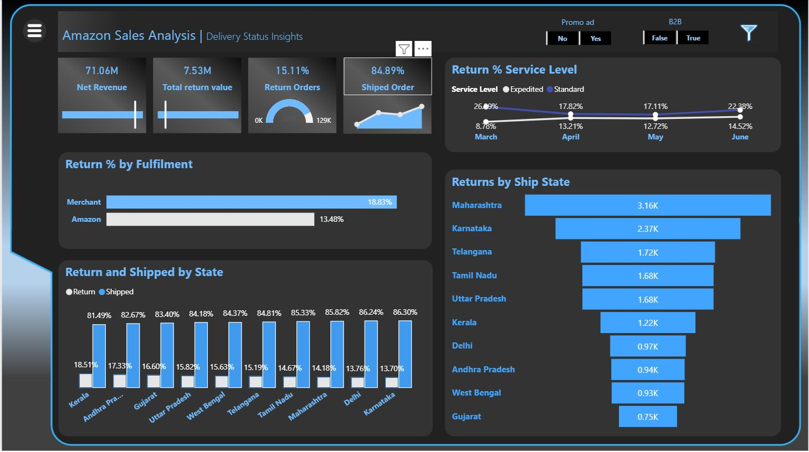
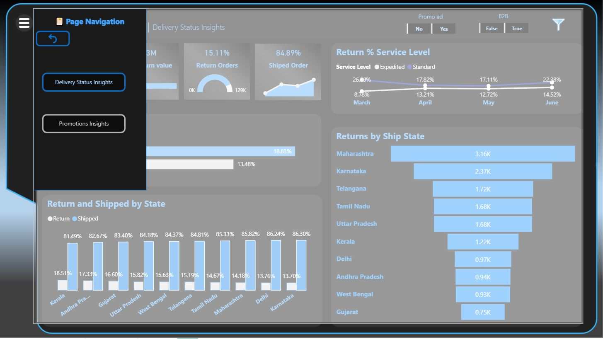
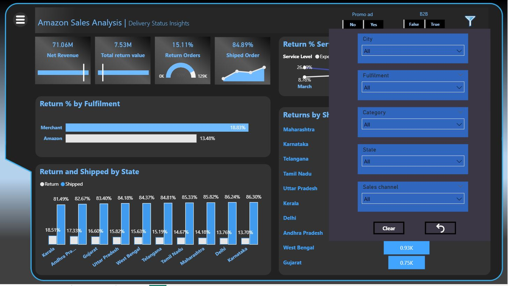
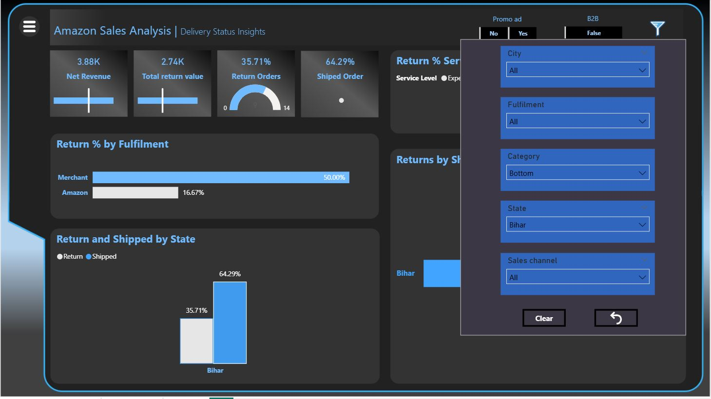
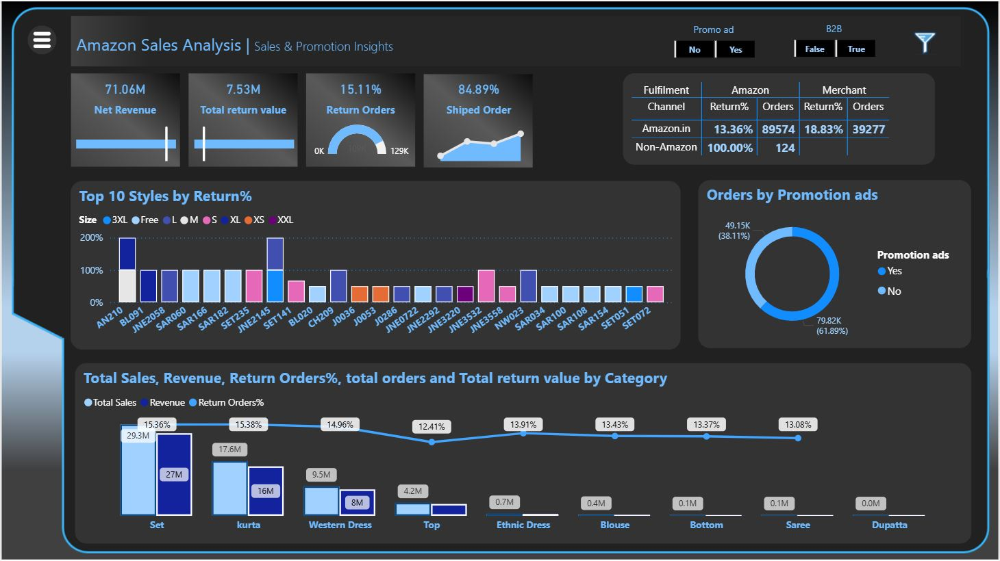
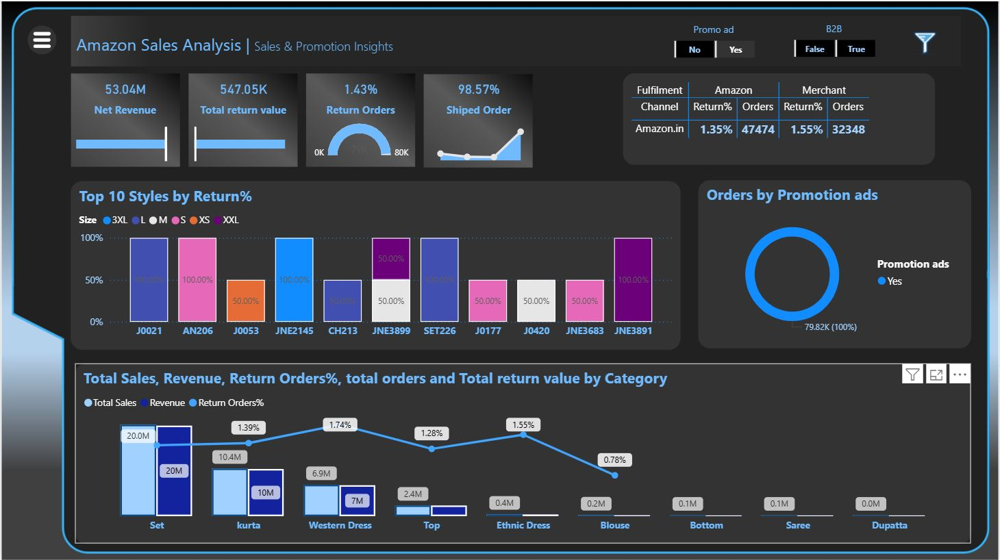
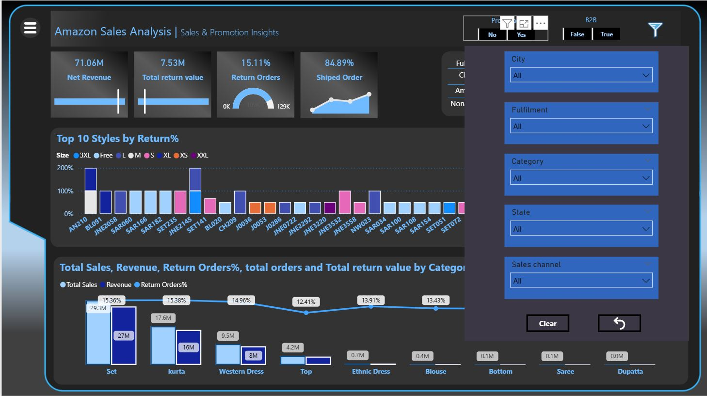

# Power BI Dashboard: Business Insights Report
🔍 Project Overview
This project is a comprehensive Power BI dashboard built using a dataset of over 128,000 rows, aimed at uncovering business insights through clean visuals and interactive elements. The original dataset contained various data quality issues, which were resolved through preprocessing and transformation.

## 🧹 Data Cleaning & Preparation
Cleaned and prepared data using Python (Jupyter Notebook) to handle missing values, incorrect entries, and standardize formats.

Ensured data integrity before loading into Power BI by eliminating duplicates and invalid records.

Conducted further transformation and shaping within Power BI Power Query Editor.

##🧠 Data Modeling & DAX
Designed an optimized star schema data model.

Created DAX measures for key KPIs such as revenue, profit margin, customer metrics, and performance indicators.

Ensured performance efficiency by minimizing calculated columns and using best practices for relationships and filters.

##📌 Features
Interactive Navigation Panel: Built with bookmarks and buttons to allow smooth navigation across all report pages.

## Dynamic Filter Panel: Consistent filters applied across pages to enhance usability and interactivity.

## Tooltip Page: Provides detailed metric definitions and contextual drilldown information on hover.

Responsive Visuals: Trend lines, bar charts, pie charts, maps, and scatter plots designed for actionable insights.

## 📈 Key Insights Delivered
Trend analysis and performance tracking across time.

Regional insights and geographic performance visualizations.

Customer segmentation and product-level performance.

Discount and profit correlation analysis.

## 🛠 Tools & Technologies Used
Power BI Desktop

DAX (Data Analysis Expressions)

Python (Jupyter Notebook)

Power Query

Bookmarks & Tooltip Pages

